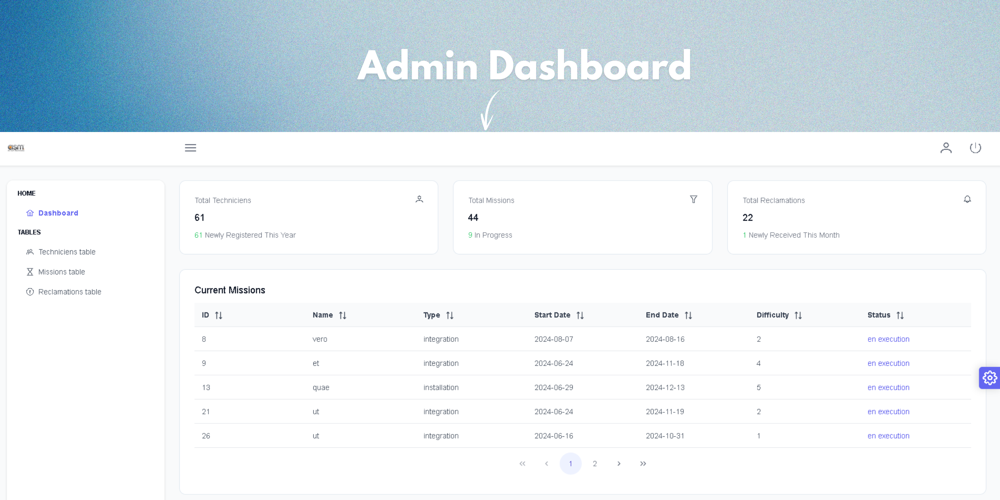
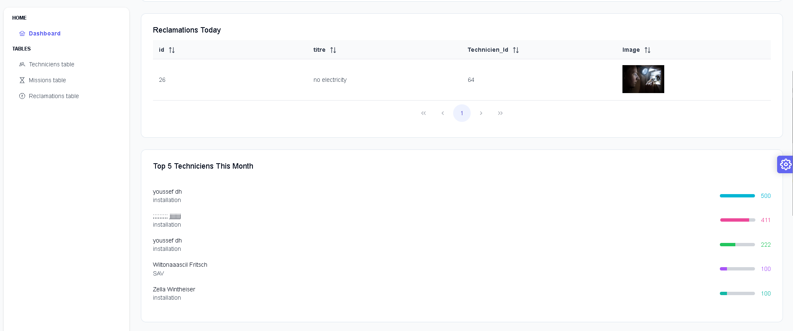
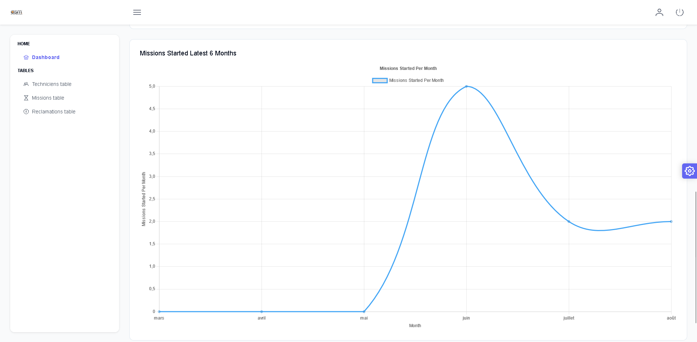

# Technician Performance Tracking App

## Description

The Technician Performance Tracking App is a comprehensive tool designed to monitor and evaluate technician performance across various metrics. Developed using Laravel for the backend and Angular for the frontend, this application offers a robust solution for managing technician data, automating administrative tasks, and enhancing operational efficiency.

Key features include responsive design, data visualization with charts, automated email notifications, and secure user authentication. The app integrates seamlessly with MySQL for database management, ensuring a reliable and scalable solution.

<div align="center">
    
</div>

## Installation

Follow these steps to install and set up the project:

```bash
# Clone the repository
git clone https://github.com/your-username/technician-performance-tracking-app.git
# Navigate to the project directory
cd technician-performance-tracking-app
```
## Backend Setup

Navigate to the backend folder and install dependencies:

```bash
cd backend
composer install
```
Set up your .env file and run migrations:
```bash
cp .env.example .env
php artisan key:generate
php artisan migrate
php artisan serve
```
## Frontend Setup

Navigate to the frontend folder and install dependencies:
```bash
cd ../frontend
npm install
```
Start the development server:
```bash
ng serve
```
## Usage

To use the project, follow these steps:

1. Clone the repository.
2. Install the backend and frontend dependencies.
3. Start both the backend and frontend servers.
4. Open the application in your browser.

## Features

This project includes the following features:

- **Responsive Design**: Works seamlessly on various devices and screen sizes.
- **Performance Tracking**: Monitor and evaluate technician performance using real-time data.
- **Automated Email Notifications**: Send automated emails to top-performing technicians and mission assignment details using templates.
- **Data Visualization**: Utilize charts for insightful data representation.
- **Secure Authentication**: Implement user authentication and security checks.
- **Advanced Functionality**: Includes features like email sending, data visualization, and secure login.

## Screenshots

Here are some screenshots of the project:
- **Admin Dashboard**  
  - Homepage




    
  *Caption: Homepage*

- About us Section
  
  *Caption: About us Section*

- Services Section
  
   
  *Caption: Services Section*

- Testimonial Section
  
  *Caption: Testimonial Section*

- footer
  
  *Caption: footer Section*


- **Technician Details**  
  *Caption: Detailed view of a technician’s performance*

- **Automated Emails**  
  *Caption: Automated email functionality*

## Video Demo

Here's a video demonstration of the project:
https://www.youtube.com/watch?v=nVTRz93AxVU&feature=youtu.be&sttick=0
[](https://www.youtube.com/watch?v=25W8MoCT-VI)


## Technologies Used

- **Frontend**: Angular, TypeScript, HTML, CSS
- **Backend**: Laravel, PHP, MySQL
- **Database**: MySQL
- **Email**: Automated email sending using templates
- **Tools**: VSCode, Git, GitHub,Postman

## Contact

For any questions or feedback, feel free to contact me at [dhouibyoussef222@gmail.com](mailto:dhouibyoussef222@gmail.com).<br>
Linkdin profile : www.linkedin.com/in/youssef-dhouib-yd2003 <br>
Project Link: https://github.com/youssefdhouib/cercina_company_landing-page


## Acknowledgments

I am grateful to ASM - All Soft Multimedia and my teammates for their support and the valuable learning experience during the development of this project.

